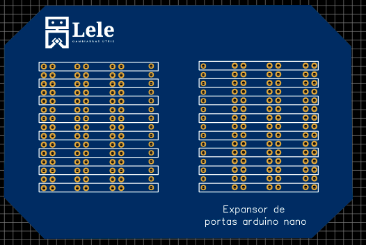

# Expansor de portas para Arduino Nano

## 🤔 O que é este projeto?
Este projeto se trata de uma PCB com o intuito de possibilitar conexões na placa arduino nano utilizando diferentes tipos de conectores que podem ser soldados na placa de acordo com a necessidade do usuário.

O projeto foi desenvolvido com o software **Easy EDA**.

## 🤔 Como este projeto está estruturado?
* Project.zip: arquivos de desenvolvimento do projeto;
* Pasta imagens: contém imagens do projeto;

## ⚙️ Componentes necessários para o projeto
A lista de componentes detalhada deste projeto pode ser encontrada na Mouser na forma de um carrinho de compras [clicando aqui.](https://www.mouser.com/ProjectManager/ProjectDetail.aspx?AccessID=22D48E511C)

|Componente|Quantidade|Observação|
|:----------:|:----------:|:----------:|
| [Arduino Nano](https://www.mouser.com/ProductDetail/782-ABX00028)  | 1  | Micontrolador utilizado na placa  |
| [Barra de 16 pinos machos](https://br.mouser.com/ProductDetail/855-M20-9731646)  |  4 |Uma barra deve ser colocada em cada lado da placa e duas barras serão usadas pra conectar o microcontrolador, mas com a necessidade do usuário este número pode ser modificado |
| [Barra de 16 pinos fêmeas](https://br.mouser.com/ProductDetail/855-M22-7131642)| 2 | Uma barra deve ser colocada em cada lado da placa, mas de acordo com a necessidade do usuário este número pode ser modificado  |   |

